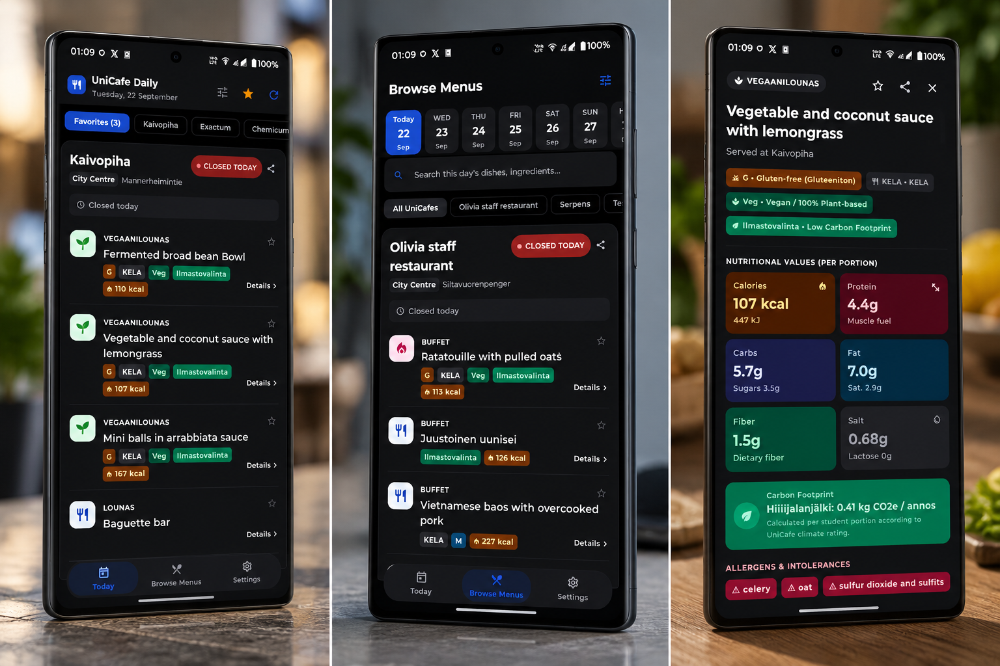

<div align="center">

# 🍽️ UniCafe Daily

### The simple way to check what's for lunch at UniCafe.

Check today's menus, find meals matching your diet, see which of your favourite UniCafes are open, browse future menus, and keep the essentials on your Android home screen.

[](https://github.com/pushan-alagiya/Unicafe-Daily/releases/latest)
[](https://github.com/pushan-alagiya/Unicafe-Daily/releases)
[](LICENSE)

</div>

---

## 📱 Screenshots

<div align="center">



</div>

> One place for today's lunch, dietary filters, favourites, opening status, and more.

---

## ✨ Features

### 🍴 Today's menus
See the latest menu information for your selected UniCafes in one place.

### ⭐ Favourite UniCafes
Choose up to three favourite restaurants and keep them at the top of your daily view.

### ❤️ Favourite dishes
Save dishes you like and quickly find them again when they appear on future menus.

### 🔎 Powerful search
Search across available menu information, including dish names, descriptions, ingredients, restaurant names, categories and dietary metadata.

### 🌱 Dietary filters
Quickly filter meals using UniCafe's dietary labels, including:

- **Veg** — Vegan
- **G** — Gluten-free
- **M** — Milk-free

Other dietary information supplied by UniCafe is also supported where available.

### 🟢 Lunch status
See whether a restaurant is:

- 🟢 **Open**
- 🟡 **Opening soon**
- 🔴 **Closed**

When possible, the app also shows how much lunch-service time remains.

### 📅 Future menus
Browse menus for upcoming dates without leaving the app.

### 🌍 Three languages
The application UI supports:

- 🇬🇧 English
- 🇫🇮 Finnish
- 🇸🇪 Swedish

### 🎲 Surprise Me
Can't decide what to eat? Let the app choose a suitable meal from the available menu.

### 💶 Lunch history & budget
Optionally keep a local history of meals and see your lunch spending over time.

### 📲 Home-screen widget
See your favourite UniCafes, menu highlights and current opening status directly from the Android home screen.

### 📡 Offline-friendly
The latest successfully fetched menu can be kept locally so temporary network problems do not leave you with an empty screen.

---

## 🚀 Download

### Android

**[⬇️ Download the latest APK](https://github.com/pushan-alagiya/Unicafe-Daily/releases/latest)**

Download the latest `.apk` from GitHub Releases and install it on your Android device.

> Because UniCafe Daily is distributed outside Google Play, Android may ask you to allow installation from the browser or file manager used to download the APK.

---

## 🧭 How it works

UniCafe Daily is a **frontend-only Android application**.

```text
            UniCafe public menu service
                       │
                       ▼
                 API / JSON data
                       │
                       ▼
                   Repository
                       │
             ┌─────────┴─────────┐
             ▼                   ▼
       Jetpack Compose       Glance Widget
          Android UI        Home-screen widget
             │                   │
             └─────────┬─────────┘
                       ▼
                  Local cache
```

There is no custom application backend.

User preferences such as favourite restaurants and other local settings are stored on the device.

---

## 🛠️ Built with

- **Kotlin**
- **Jetpack Compose**
- **Material 3**
- **Retrofit / HTTP networking**
- **Kotlin Coroutines**
- **DataStore**
- **Jetpack Glance**
- **WorkManager**
- **AndroidX**

The API/DTO layer is separated from the UI and domain models so changes to the UniCafe data source can be handled without rewriting the interface.

---

## 🔐 Privacy

UniCafe Daily is designed to work without an account.

The app does not need:

- GPS/location permission
- Contacts
- Camera
- Microphone
- User registration
- A custom backend

Favourite restaurants, app preferences and optional local features are stored on the device.

See [PRIVACY.md](PRIVACY.md) for the current privacy statement.

---

## ⚠️ Unofficial application

**UniCafe Daily is an independent, student-made application.**

It is **not affiliated with, endorsed by, or officially associated with UniCafe or the University of Helsinki**.

UniCafe remains the source of the menu and restaurant information displayed by the app.

---

## 🧑‍💻 Development

Clone the repository:

```bash
git clone https://github.com/pushan-alagiya/Unicafe-Daily.git
cd Unicafe-Daily
```

Build a debug APK:

```bash
./gradlew assembleDebug
```

The APK will be generated at:

```text
app/build/outputs/apk/debug/app-debug.apk
```

Install it on a connected Android device:

```bash
adb install -r app/build/outputs/apk/debug/app-debug.apk
```

### Release build

The project uses a release signing configuration for public builds. Signing credentials must never be committed to the repository.

GitHub Actions can build the release APK and publish versioned releases.

---

## 📦 Releases

Public releases are published on GitHub:

**https://github.com/pushan-alagiya/Unicafe-Daily/releases**

Latest release:

**https://github.com/pushan-alagiya/Unicafe-Daily/releases/latest**

Version tags follow a simple versioning scheme such as:

```text
v1.0.0
v1.0.1
v1.1.0
```

---

## 🤝 Contributing

Found a bug or have an idea?

Open an issue or pull request on GitHub:

**https://github.com/pushan-alagiya/Unicafe-Daily**

When reporting a problem, include the Android version, device model, app version, and steps to reproduce when possible.

---

## ⭐ Support the project

If UniCafe Daily saves you time when choosing lunch, consider giving the project a ⭐ on GitHub.

<div align="center">

**Made for students in Helsinki 🇫🇮**

</div>
